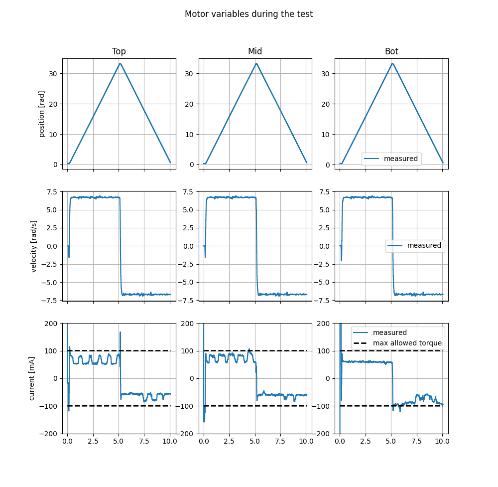
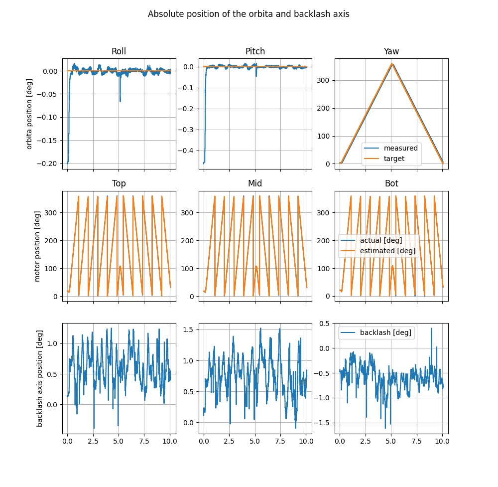

## Benchmark testing of the Orbita3d controller

The benchmarking program is in the `main.rs` and the benchmarking data and tools are in `scripts` directory.

In the benchmarking directory are the python scripts to generate the benchmarking input data and to plot the benchmarking results.
- `generate_input_data.py` generates the benchmarking input data
   - outputs a csv file with the benchmarking input `csv` data
- `plot_test_data.py` plots the benchmarking results
    - plots the figures showing the test results

Test plot outputs:




### Pre-requisites

To install the testbench you'll need to have:
- Rust installed - see [Rust installation](https://www.rust-lang.org/tools/install)
- EtherCAT IgH master installed - see [EtherCAT IgH master installation](https://pollen-robotics.github.io/orbita3d_control/installation/installation_ethercat/)

### Installation

To install the testbench do the following:
```bash
git clone https://github.com/pollen-robotics/orbita3d_testbench.git
cd orbita3d_testbench
```

build the project:
```bash
cargo build --release
```

### Running the benchmarking program

The benchmarking program is in the `main.rs`. The benchmarking program takes in a timeseries csv file with the target values of the orbita3d actuator. The benchmarking program will send the target values to the orbita3d actuator and record the actual values of the actuator. The benchmarking program will output a csv file with the actual values of the actuator.

> Generate the test input data by running the `generate_input_data.py` script in the `scripts` directory. The script will output a csv file with the benchmarking input data.

To run the program do the following:
```bash
RUST_LOG=info cargo run --release -- 
```
The program will ask you the path to the input and the output csv files and will also use the default configuration file `config/fake.yaml`. If you want to use a different configuration file, you can specify it with the `--configfile` flag. 

Additionally, you can specify the `--viewer` flag to view the actuator in the `Rerun` program.

Finally, you can also specify the input and output csv files with the `--input-csv` and `--output-csv` flags.

List of flags:
- `--configfile` - specify the configuration file (default is `config/fake.yaml`, other options are for example: `config/ethercat_poulpe.yaml`)
- `--input-csv` - specify the input csv file
- `--output-csv` - specify the output csv file
- `--start-server` - start the EtherCAT server (IMPORTANT mandatory if not already running)
- `--viewer` - view the actuator in the `Rerun` program
    - Note: the `Rerun` program must installed separately 
    ```
    cargo install cargo-binstall
    cargo binstall rerun-cli
    ````

### Running the benchmarking program with the benchmarking data
- Run the test program with an input csv file:
  - ie: 
```shell
cargo run --release -- --start-server --configfile=config/ethercat_poulpe.yaml --input-csv=benchmarking/test_input.csv --viewer --output-csv=test_output.csv
```
